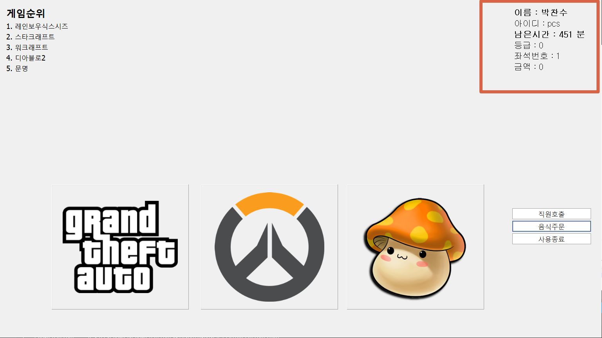
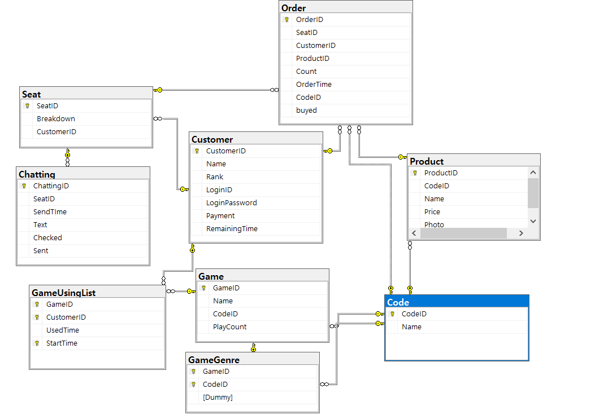
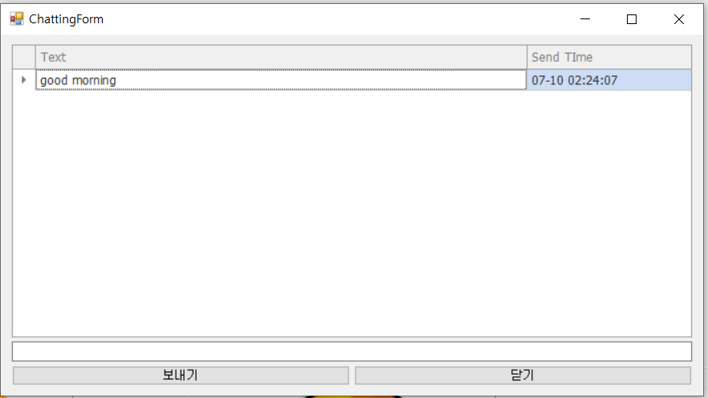
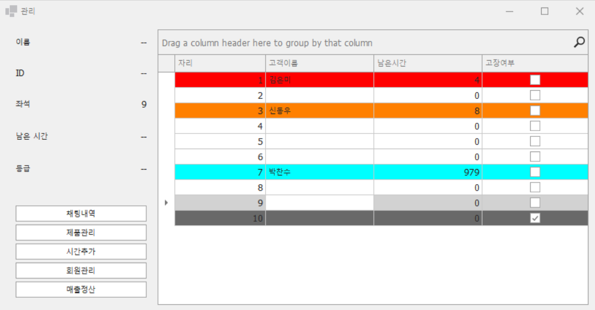
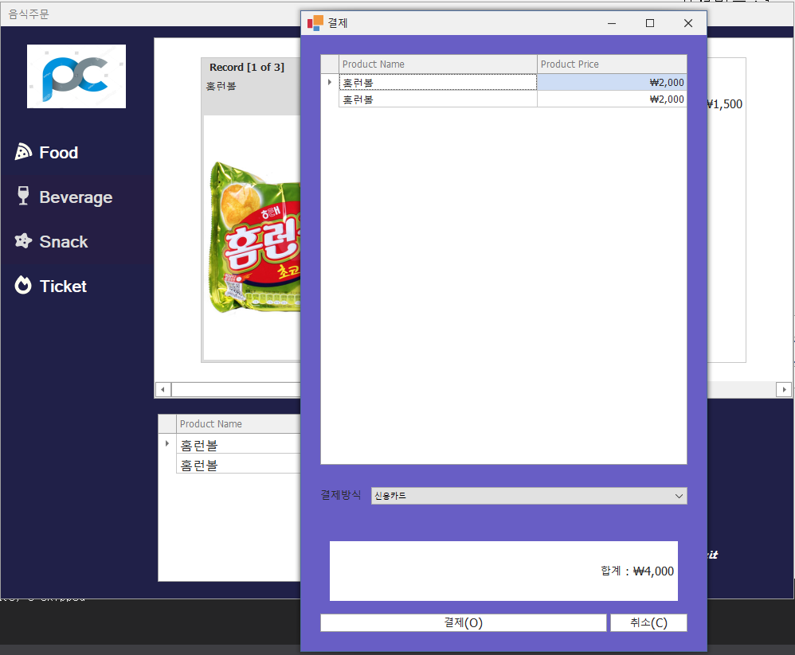
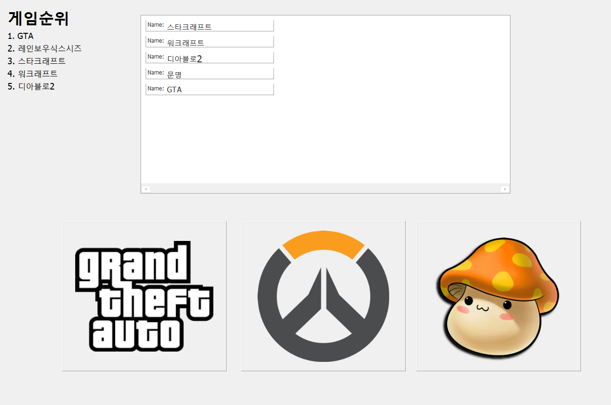

# 개관

# 기능
* PC방 관리 프로그램

### 고객
* 빠른 게임 접속
* 음식 주문 및 시간 연장
* 실시간으로 관리자와 채팅
* 실시간 게임 순위 확인 (클릭 수에 따라서 순위가 바뀝니다.)

### 관리자
* 실시간으로 고객과 채팅
* 고객 시간 추가
* 사용중인 고객 확인
* 매출 확인
* 회원 관리

# 사용기술
### 언어
* C# 3.0+

### 프레임워크
* .NET Framework 4.8
* Winform
* Entity Framework

### 서드파티 컨트롤
* DevExpress WinForms

### 데이터베이스
* MS-SQL Server 2019

# 데이터베이스 스키마

# Point of Interest
* 고객과 관리자간의 실시간 채팅 가능

* 관리자 프로그램 분리, 관리 효율 증대

* 음식 주문에 따른 금액 동기화

* 사용 금액을 토대로 나눈 회원 등급
* 인기 게임 순위 목록
* 타이머를 이용한 남은 시간 계산 (현재 단위는 분으로 설정되어있지만 개발과정의 편리성을 위해 2초에 1분씩 줄어들게 설계)

* 각 게임 장르로 구분된 폴더에 빠른 접속기능 (왼쪽부터 순서대로 CD게임, FPS, RPG)

# 미해결 부분
* 월간 게임순위
* 환불 계산
* 음식주문 창 열시 전체화면 축소
* 관리자가 고객 강제사용종료 기능 미구현
* polling을 사용하여 실시간 동기화 구현 (정보가 적어서 thread를 사용하지 않음)
  