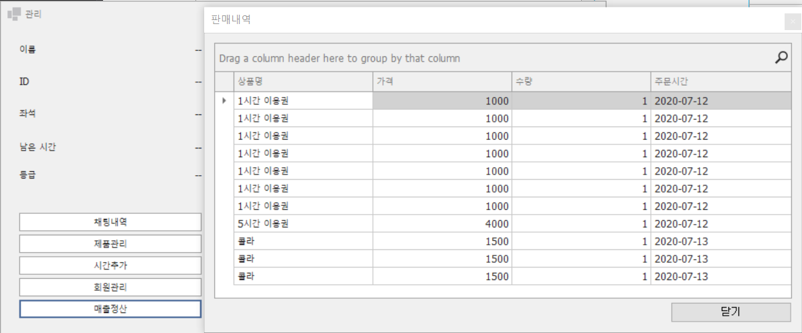
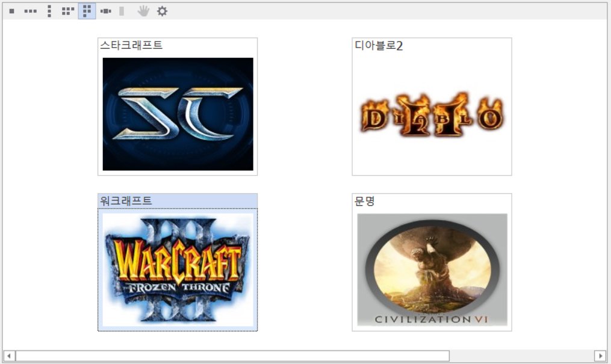
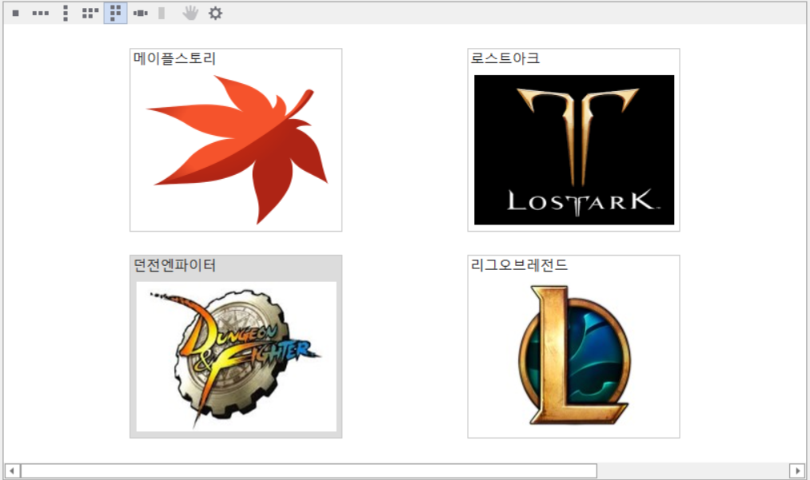
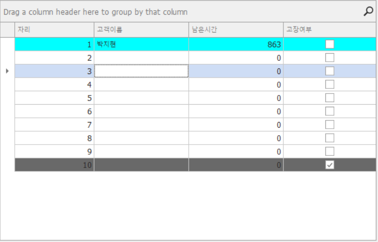
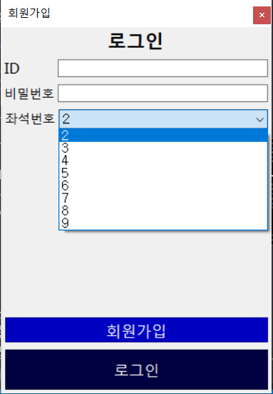

# 개관

# 기능
* PC방 관리 프로그램

### 고객
* 자리 내 음식 주문 및 시간 연장
* 실시간으로 관리자와 채팅 가능
* 실시간 게임 순위 확인 (게임 타이틀 더블클릭 수에 따라서 순위가 바뀝니다.)
* 사용 종료시 사용자의 잔여 시간 자동 저장

### 관리자
* 실시간으로 고객과 채팅 가능
* 고객 사용시간 관리 가능
* 사용중인 고객 확인
* 매출 확인
* 회원 관리

# 사용기술
### 언어
* C# 3.0+

### 프레임워크
* .NET Framework 4.8
* Winform
* Entity Framework

### 서드파티 컨트롤
* DevExpress WinForms

### 데이터베이스
* MS-SQL Server 2019

# 데이터베이스 스키마

# Point of Interest
* 고객과 관리자간의 실시간 채팅 가능

* 관리자 프로그램 분리, 사용자별 잔여 시간에 따른 색상 변경

* 관리자 프로그램 내에서 판매내역 확인가능

* 음식 주문에 따른 금액 동기화

* 인기 게임 순위 목록 구현
* 사용 금액을 토대로 나눈 회원 등급
* 타이머를 이용한 남은 시간 계산 (현재 단위는 분으로 설정되어있지만 개발과정의 편리성을 위해 5초에 1분씩 줄어들게 설계)

* 각 게임 장르로 구분된 폴더에 빠른 접속기능 (왼쪽부터 순서대로 CD게임, FPS, RPG)
* 게임 아이콘 이미지는 데이터베이스에 바이너리 형식으로 저장됨

* 각 좌석별 컴퓨터 고장 여부 확인 가능 및 고장시 사용자 해당 좌석 사용 불가능

# 미해결 부분
* 환불 계산
* 음식주문 창 열시 전체화면 축소
* 관리자가 고객 강제사용종료 기능 미구현
* 소켓 프로그래밍 대신 Windows 타이머와 polling 기법을 사용하여 실시간 동기화 구현